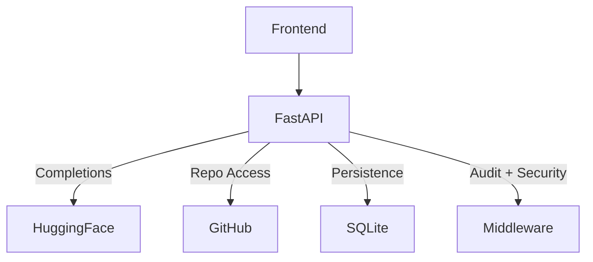

# AI-Dev-Federation-Dashboard - Integrations Overview

## 🎯 Purpose

The **AI-Dev-Federation-Dashboard** integrates with several third-party services to power its multi-agent orchestration system.  
These integrations enable AI completions, repository navigation, persistence, and security enforcement.

---

## 🔑 Hugging Face (AI Completions)

**Purpose**: Provide AI reasoning and completions for planning + file reviews  

**Integration**:  
- `hf_client.py` → wraps Hugging Face Router API  
- Uses `HF_API_KEY`, `HF_MODEL`, and `HF_MAX_TOKENS` from `.env`  
- System presets: `brainstorm`, `structure`, `file`  

**Features**:  
- Streaming responses with retry + exponential backoff  
- Unified debug logging for requests + responses  

**Risks**:  
- API keys must remain secret (`.env`)  
- Latency/availability tied to external API uptime  

---

## 🔑 GitHub (Repository Access)

**Purpose**: Live repo navigation + file retrieval for DevBot execution  

**Integration**:  
- `github_service.py` → REST API wrapper for tree + file content  
- Supports fine-grained or classic tokens via `.env`  
- Aliases (`get_file`) for backward compatibility with task runner  

**Features**:  
- Branch/SHA resolution for stable queries  
- File decoding with truncation for large content  

**Risks**:  
- Token exposure risk (must remain in `.env`)  
- GitHub API rate limits may impact frequent requests  

---

## 🔑 SQLAlchemy + SQLite (Persistence)

**Purpose**: Store users, tasks, logs, and memory for orchestration  

**Integration**:  
- `models.py` → ORM models (`User`, `Task`, `AuditLog`, `Memory`)  
- `database.py` → session management + connections  

**Features**:  
- Tracks execution history + audit logs  
- Stores per-user conversation memory  

**Risks**:  
- SQLite is local-only — for scale, migrate to PostgreSQL  
- PII (emails, auth) must be protected  

---

## 🔑 Middleware (Security & Logging)

**Purpose**: Enforce allowlist + rate limiting + audits  

**Integration**:  
- `security.py` → FastAPI middleware  
- Config-driven endpoint allowlist (`config/endpoint_allowlist.yaml`)  
- Guest users limited to 5 tasks/minute  

**Features**:  
- Unified audit logs (`AuditLog` table)  
- Guest fallback with `NULL user_id`  

**Risks**:  
- Misconfigured allowlist could expose endpoints  
- Guest task abuse without rate limit enforcement  

---

## 📋 Integration Data Flow

---

## ⚡ Integration Strengths

- **Real-world APIs** → GitHub + Hugging Face tightly integrated  
- **Separation of concerns** → AI completions, repo access, persistence, security  
- **Unified debug + audit logging** → Improves observability  
- **Extendable design** → Swap SQLite → PostgreSQL, add more agents easily  
